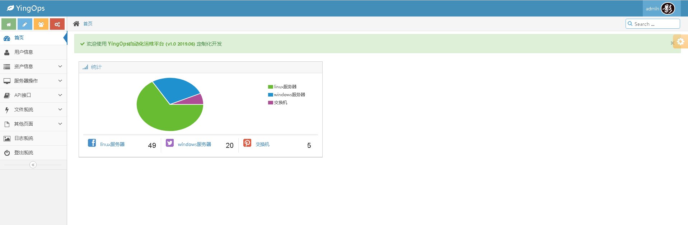
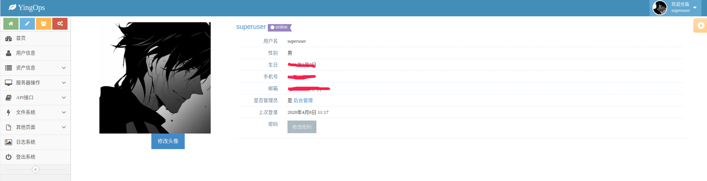
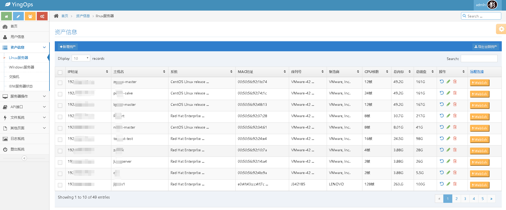
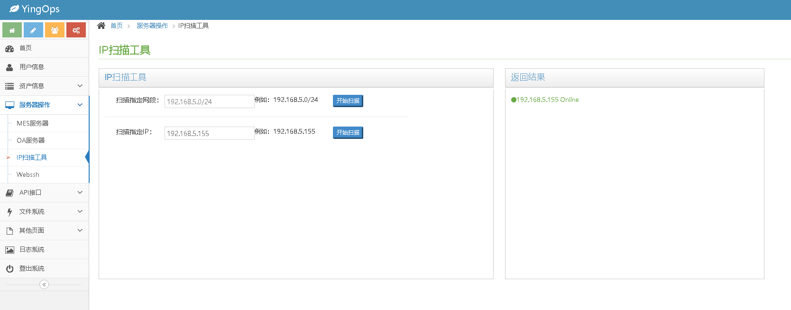
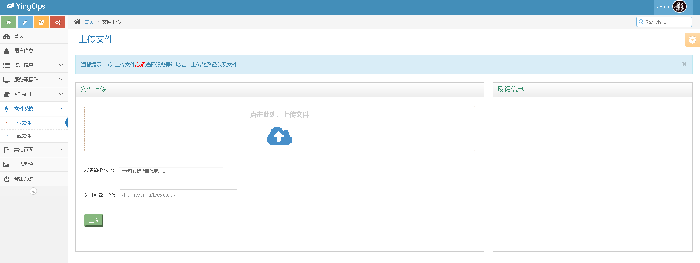
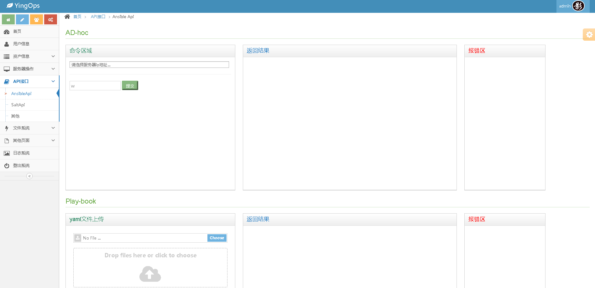
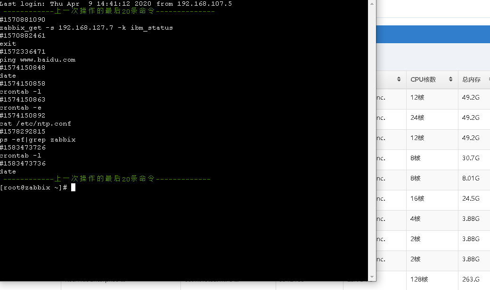

# yingops
[查看代码-码云](https://gitee.com/xiaoqying/yingops)
[查看代码-Github](https://github.com/xiaoqying/YingOps)
### 介绍
使用python3.6 + django2.1.8开发的自动化运维平台；
可以一键生成CMDB资产信息，支持导入导出功能，通过Ansible，SaltStack来管理主机，集成webssh等
想要添加其他功能的话，小伙伴们可以留言，可以进行筛选后进行新增

### 软件架构
python3.6 + django2.1.8

### 安装部署
#### 安装python环境
写个脚本自动安装一下python及虚拟环境：[脚本](https://github.com/xiaoqying/YingOps/edit/master/scripts)
#### 安装依赖
```
pip install -r requirements.txt
```
#### 启动
启动之前需要配置好数据库连接
```
$Install_HOME/YingOps/settings.py
python manager.py createsuperuser
python manager.py runserver 0.0.0.0:8888
```
#### 访问
```
ip:8888
输入用户名密码即可
```
### 项目截图
#### 首页

#### 用户信息

#### 资产列表

#### IP扫描工具

#### 上次下载文件

#### Ansible

#### webssh


### 暂不提供demo预览
[博客地址1](http://blog.xiaoqying.com)
[博客地址2](http://bk.xiaoqying.com)
### QQ交流群  


> 感兴趣的同学可以加入我的QQ交流群,代码我也会不断进行更新，感谢大家的支持。
- QQ群：980731772
- 一键加入QQ群：
<a target="_blank" href="//shang.qq.com/wpa/qunwpa?idkey=e397bb4c6006b7be6f037ef4665be4e7dedcbd50466c5c0ec1991c963ef79419"></a>

- 扫描二维码加群


微信公众号：LinuxPython运维开发


